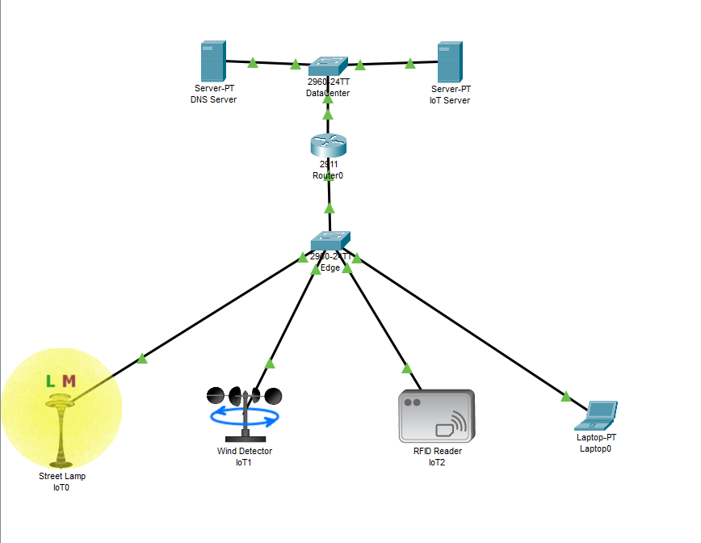

# SmartCity IoT Infrastructure:

## Executive Summary
This repository contains a complete, enterprise-grade simulation of a Smart City IoT network built using **Cisco Packet Tracer**. The architecture demonstrates the secure integration of physical edge devices (sensors and actuators) with a centralized Cloud/CMS environment. 

By implementing **VLAN segregation, Router-on-a-Stick (802.1Q), and dynamic DHCP provisioning**, this project proves how to securely route telemetry data from vulnerable field devices across a core transport network to a centralized management backend.



---

## Repository Structure
```text
Smart-City-IoT-Simulation
 ┣ Configurations         
 ┃ ┣ Router CLI.txt       
 ┃ ┗ Switch (Edge) CLI.txt     
 ┣ Screenshots                 
 ┃ ┣ Network Topology.png
 ┃ ┣ CMS Dashboard.png
 ┃ ┣ CMS Login Page.png
 ┃ ┗ DNS Resolution and Connectivity.png
 ┣ SmartCity_IoT_Infrastructure.pkt  # Executable Cisco Packet Tracer file
 ┗ README.md

```

---

## 3-Tier Network Architecture

The network is logically segmented into three tiers to prevent broadcast storms, ensure security, and isolate IoT traffic from management subnets.

### 1. The Edge (IoT Layer)

* **Hardware:** Simulated Street Lamp, Wind Detector, and RFID Reader.
* **Connectivity:** Wired FastEthernet connections to the access layer.
* **Network Behavior:** All devices operate dynamically as DHCP clients, receiving IP configurations, gateway, and DNS parameters upon network initialization.

### 2. The Transport (Network Layer)

* **Hardware:** Cisco 1941 Core Router, Cisco 2960 Access/Distribution Switches.
* **Layer 2 Logic:** The access switch segments all edge devices into a dedicated broadcast domain (**VLAN 20: SmartCity_IoT**). A trunk link carries the 802.1Q tagged frames to the core router.
* **Layer 3 Logic:** The core router utilizes subinterfaces to perform **Inter-VLAN Routing**, acting as the Default Gateway and DHCP Server for the IoT subnet while providing a routed path to the server infrastructure.

### 3. The Cloud (CMS Layer)

* **Hardware:** Dedicated DNS Server and IoT Central Management System (CMS) Server.
* **Network Behavior:** Hosted on a separate, static `/24` subnet. The DNS server handles FQDN resolution (`cms.smartcity.com` -> `10.0.0.10`), allowing edge devices to register with the CMS backend using domain names rather than hardcoded IPs.

---

## IP Addressing & VLAN Schema

| Subnet Purpose | VLAN ID | Network Address | Subnet Mask | Default Gateway |
| --- | --- | --- | --- | --- |
| **Server / Cloud** | Default (1) | `10.0.0.0` | `255.255.255.0` | `10.0.0.1` |
| **SmartCity IoT** | 20 | `192.168.20.0` | `255.255.255.0` | `192.168.20.1` |

### Core Server IP Allocations

* **Core Router (Gi0/1):** `10.0.0.1`
* **DNS Server:** `10.0.0.5`
* **IoT CMS Server:** `10.0.0.10`

---

## Hardware Configurations

To maintain readability, the full CLI scripts used to provision the network hardware have been separated into dedicated files. You can review the exact Cisco IOS commands used to build this architecture in the [`/Configurations`](https://github.com/iamsanjaynarayanan/PacketTracer-Simulations/tree/main/SmartCity-IoT-Infrastructure/Configurations) folder:

1. **[Router CLI.txt](https://github.com/iamsanjaynarayanan/PacketTracer-Simulations/blob/main/SmartCity-IoT-Infrastructure/Configurations/Router%20CLI.txt)**: Contains the logic for the Server Subnet Gateway, Router-on-a-Stick (802.1Q) subinterfaces, and the dynamic DHCP pool.
2. **[Switch (Edge) CLI.txt](https://github.com/iamsanjaynarayanan/PacketTracer-Simulations/blob/main/SmartCity-IoT-Infrastructure/Configurations/Switch%20(Edge)%20CLI.txt)**: Contains the Layer 2 logic for VLAN 20 creation, assigning access ports to the IoT devices, and configuring the gigabit uplink as an 802.1Q trunk.

---

## Testing & Validation Methodology

The following tests were conducted to ensure strict network security and end-to-end functionality:

### 1. DHCP Lease Validation

Verified that all edge devices successfully acquired IPs in the `192.168.20.X` range and received the correct DNS suffix.


### 2. Network Reachability & DNS Resolution

ICMP echo requests (Pings) were sent from an IoT client to the FQDN `cms.smartcity.com`. The successful replies verified that the DNS server was reachable across VLAN boundaries and that Inter-VLAN routing was functioning properly.

### 3. Real-Time Telemetry & CMS Actuation

Environmental conditions were manipulated within the simulation. The telemetry was successfully routed through the core network to the CMS, updating the dashboard in real-time. Remote commands executed from the web dashboard were successfully pushed back to the physical access layer.


---

## Key Takeaways & Engineering Value

* **Network Isolation:** Proved the ability to segment unmanaged IoT devices away from critical server infrastructure using VLANs and 802.1Q encapsulation.
* **Scalable Provisioning:** Eliminated the need for static IP management at the edge by architecting a robust, router-driven DHCP deployment.
* **End-to-End Systems Thinking:** Demonstrated the flow of data from physical hardware layers (sensors) through complex transport layers (routing/DNS) into application layers (Web CMS).

---

```

```
